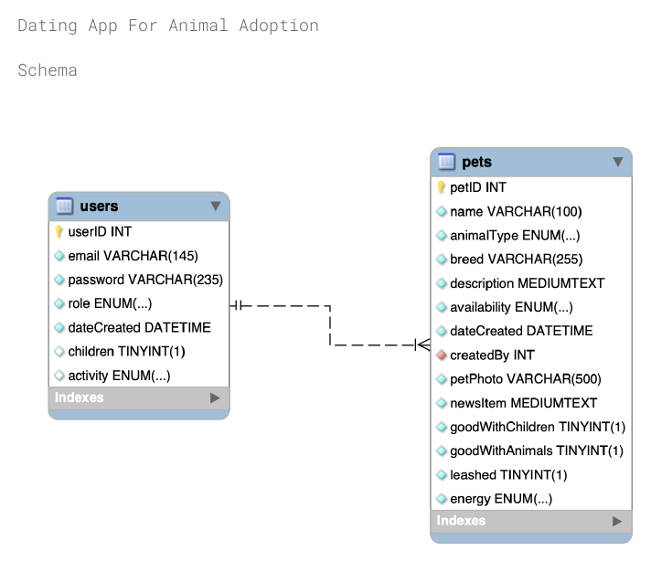

# Pet Adoption Match — "Dating App for Animal Adoption"

A full-stack web app that matches people with adoptable pets. Adopters create a profile
(household with children, activity level), browse and filter pets, and view each pet's profile.
Shelter admins manage pet profiles through a protected dashboard.

## My Contribution
This was a 4-person team capstone project. I built the React frontend — the adopter-facing pages
(search/filter, pet profiles, registration/login UI) and the API client
([`frontend/src/services/petsApi.js`](frontend/src/services/petsApi.js)). The Django backend, REST API,
JWT auth, and database schema were built by teammates.

## Features
- **Adopters:** register/login, search pets by type, breed, disposition (good with children/animals, leashed), date added and availability, view detailed pet profiles and shelter contact info
- **Admins:** create, edit and delete pet profiles; search by pet ID; admin registration requires a server-side secret key
- **REST API** with JWT authentication and role-based permissions (reads are public, writes are admin-only)

## Tech stack
| Layer | Technology |
|---|---|
| Frontend | React 19, React Router, Vite |
| Backend | Django 5, Django REST Framework, PyJWT |
| Database | PostgreSQL in production; SQLite for local runs |
| Deployment | Render (Gunicorn + WhiteNoise) |

## Project structure
```
backend/    Django project (config/), accounts app (register, login, JWT auth), pets app (pets API), dbmodels app (users/pets tables)
frontend/   React app (pages for adopters and admins, API client in src/services/petsApi.js)
database/   DatingAppDDL.sql (schema + sample data) and schema.png
```



## Run locally

**Backend** (Python 3.10+):
```bash
cd backend
python3 -m venv .venv && source .venv/bin/activate
pip install -r requirements.txt
cp .env.example .env              # optional settings, e.g. ADMIN_SECRET_KEY
python manage.py init_local_db    # creates a SQLite database with sample users and 18 pets
python manage.py runserver        # http://127.0.0.1:8000
```

**Frontend** (Node 20+), in a second terminal:
```bash
cd frontend
npm install
npm run dev                       # http://localhost:5173
```

**Sample accounts** (from the sample data):

| Role | Email | Password |
|---|---|---|
| Admin | admin1@example.com | examplepass1 |
| Adopter | adopter1@example.com | examplepass33 |

## API
| Method | Endpoint | Access |
|---|---|---|
| POST | `/api/auth/register/` | Public |
| POST | `/api/auth/token/` | Public — returns a JWT |
| GET | `/api/auth/me/` | Logged in |
| GET | `/api/pets/` (`?petId=`, `?animalType=`, `?availability=`, `?search=`) | Public |
| GET | `/api/pets/<id>/` | Public |
| POST / PATCH / PUT / DELETE | `/api/pets/`, `/api/pets/<id>/` | Admin |

## Tests
```bash
cd backend && python manage.py test accounts
```

## Deployment
Set `DATABASE_URL`, `DJANGO_SECRET_KEY`, `DJANGO_ALLOWED_HOSTS`, `DJANGO_CORS_ALLOWED_ORIGINS`,
`DJANGO_CSRF_TRUSTED_ORIGINS` and `ADMIN_SECRET_KEY` on the backend, and `VITE_API_BASE_URL` on the frontend.
Start the backend with `python manage.py collectstatic --noinput && gunicorn config.wsgi`.

Pet photos are from [Pixabay](https://pixabay.com/) (free to use under the Pixabay license).
